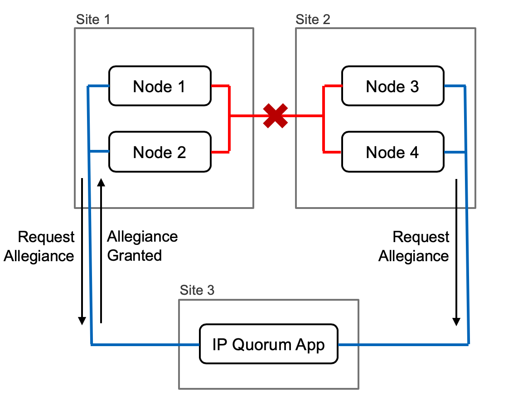

IBM Spectrum Virtualize IP-Quorum Ansible Role
=========

[](https://github.com/olemyk/ansible-ipquorum/issues) 
[](https://github.com/olemyk/ansible-ipquorum/) 
[](https://galaxy.ansible.com/olemyk/ansible_ipquorum) 
[](LICENSE)
[](RedHat)
[](CentOS)

Ansible role for installing and configuring IP-Quorum Service for Spectrum Virtualize (SAN: SVC, Storwize, v9000, FS9100)

- The IP quorum application is a Java™ application that runs on a separate server or host.
- A quorum device is used to break a tie when a SAN fault occurs, when exactly half of the nodes that were previously a member of the system are present
- An IP quorum application is used in Ethernet networks to resolve failure scenarios where half the nodes or enclosures on the system become unavailable. 
- In this scenario, the application determines which nodes or enclosures can continue processing host operations and avoids a split system, where both halves of the system continue to process I/O independently. 


Particularly looking for [feedback](https://github.com/olemyk/ansible-ipquorum/issues) and future [requirements](https://github.com/olemyk/ansible-ipquorum/issues/new)!


Features
------------

- **Creates IP-Quorum Service, (So it starts and stops with host)**
- **Copy inn IP-Quorum.jar file from local folder**
- **Creates Banner with IP-Quorum Service Information**
- **Disables or Create Firewalld rules.**
- **Check and disabled selinux**
- **Create new IP-Quorum app file directly from SV node (Requires Repo)**
    - Connects to SV nodes and Generate new IP-Quorum app file
    - Copy inn new IP-Quorum app directly from SV nodes
- **Installation of Supported Java**
     - OpenJDK (Requires Repo)
     - Java IBM (Local Install files or url)
     - JavaSDK Oracle (Local Install files or url)


- **The following installation methods are available:**
    - Install from (existing) YUM repository
    - Install Java from local files or URL


- **Future plans:**
    - Better Java Installer
    - More checks
    - Using RestAPI to Create new IP-Quorum APP on SV (Not Available yet)
    - SSHPASS without sshkey is not the safest way, So adding the use of ssh-key.
    - Several IP-Quorum Services


Tested on:
----------
 - Tested only on Centos, RedHat. Version 7.6 - 8.1
 - Tested with Root. 


Requirements:
------------
  
-  When using Java OpenJDK you will need a repo to install `java-1.8.0-openjdk`
-  When using Create new IP-Quorum app file directly from SV node, it will try to install `sshpass` YUM repo is needed for this. (epel repo is configure)
-  When using the firewall change it will check for installed firewall rpm with yum-util.
  

Installation:
------

$ ansible-galaxy install olemyk.ansible_ipquorum
There is also now git tags / versions on commits and functions. Se Release Notes 


Role Variables:
--------------


- Default variables are defined in defaults/main.yml. 
You'll also find detailed documentation in that file. 
Define your own variables in your inventory or playbook to override the defaults.

- Defining the `ipquorum_install_openjdk_packages:` is mandatory. 

Dependencies:
------------

No dependencies.

Example Playbook
----------------

**Example 1:** (YUM repo already configured)


- `ipquorum_install_openjdk_packages: java-1.8.0-openjdk`
   Installs IP-Quorum with OpenJDK.
- ` ipquorum_nometadata: '-nometadata' `
   When set to. '-nometadata'`  it will not generate ip-quorum app that stores configuration data for node recovery operations. (default is with metadata)

Default Options
- `ipquorum_local_ipquorum_app_src: `
This copies inn the IP-Quorum APP from local folder on your Control node. (Default is /files in your ansible role).
- ` ipquorum_reboot_automatic: true `
Default it will try to disabled the selinux, if that changes the server will reboot.

```
    - hosts: ipquorum
      gather_facts: true
      remote_user: root
      vars:
        - ipquorum_install_openjdk_packages: java-1.8.0-openjdk
        - ipquorum_nometadata: '-nometadata'
      roles: 
        - role: olemyk.ansible_ipquorum
```


**Example 2:**

- `ipquorum_install_openjdk_packages: java-1.8.0-openjdk`
   Installs IP-Quorum with OpenJDK.
- `ipquorum_firewall_config_change: true`
    Configures firewall with port 1260/TCP to Public Zone.
- `ipquorum_banner_motd: true`
   Configures Linux MOD/Banner with Information about IP-Quorum Service.
- ` ipquorum_nometadata: '-nometadata' `
   When set to. '-nometadata'`  it will not generate ip-quorum app that stores configuration data for node recovery operations. (default is with metadata)
- `ipquorum_sv_box_one `
Is defined, it will connect to the SV cluster and Generate new IP-Quorum app file, and copy inn new IP-Quorum app directly from SV nodes
Populate the field with your Spectrum Virtualize information.
    - `username:` The user needs to have an Administrator Role on the Spectrum Virtualize
    - `password:` This task uses SSHPASS and the password is set to environment/export to minimise the security risk.
    - `ip_address:` ip_adress of your Spectrum Virtualize nodes.

Defaults
- ` ipquorum_reboot_automatic: true `
Default it will try to disabled the selinux, if that changes the server will reboot.
```
    - hosts: ipquorum
      gather_facts: true
      vars:
        - ipquorum_install_openjdk_packages: java-1.8.0-openjdk
        - ipquorum_firewall_config_change: true
        - ipquorum_banner_motd: true
        - ipquorum_nometadata: '-nometadata'
        - ipquorum_sv_box_one:
            username: 'superuser'
            password: 'superduperpassword'
            ip_address: '10.10.10.10'
      roles: 
        - role: olemyk.ansible_ipquorum
```

**Example 3:**

- `ipquorum_install_javaibm_packages: 'ibm-java-x86_64-jre-8.0-5.40.bin'`
   Name of bin installer for IBM JAVA JRE.
-  `ipquorum_install_javaibm_src_url: `
    Copies the install bin from URL, full path is needed.
- `ipquorum_firewall_config_change: true`
    Configures firewall with port 1260/TCP to Work Zone.
- `ipquorum_firewall_config_change_config: Zone: Work`
    zone: Work
- `ipquorum_banner_motd: true`
   Configures Linux MOD/Banner with Information about IP-Quorum Service.
- ` ipquorum_nometadata: '-nometadata' `
   When set to. '-nometadata'`  it will not generate ip-quorum app that stores configuration data for node recovery operations. (default is with metadata)
- `ipquorum_sv_box_one `
Is defined, it will connect to the SV cluster and Generate new IP-Quorum app file, and copy inn new IP-Quorum app directly from SV nodes
Populate the field with your Spectrum Virtualize information.
    - `username:` The user needs to have an Administrator Role on the Spectrum Virtualize
    - password:` This task uses SSHPASS and the password is set to environment/export to minimise the security risk.
    - `ip_address:` ip_adress of your Spectrum Virtualize nodes.

Defaults
- ` ipquorum_reboot_automatic: true `
Default it will try to disabled the selinux, if that changes the server will reboot.
```
    - hosts: ipquorum
      gather_facts: true
      vars:
        - ipquorum_install_javaibm_packages: 'ibm-java-x86_64-jre-8.0-5.40.bin'
        - ipquorum_install_javaibm_src_url: 'http://mywebserver/ibm-java-x86_64-jre-8.0-5.40.bin'
        - ipquorum_firewall_config_change: true
        - ipquorum_firewall_config:
            zone: 'work'
        - ipquorum_banner_motd: true
        - ipquorum_nometadata: '-nometadata'
        - ipquorum_sv_box_one:
            username: 'superuser'
            password: 'superduperpassword'
            ip_address: '10.10.10.10'
      roles: 
        - role: olemyk.ansible_ipquorum
```


**Example 4:**

- `ipquorum_install_javasdk_src_local: '/Users/olemyk/Downloads/'`
   Copies inn the java install packages local folder.
- `ipquorum_install_javasdk_archive_package: 'jdk-8u221-linux-x64.tar.gz'`
    Name of the archive file.
-  `ipquorum_install_javasdk_packages: 'jdk1.8.0_221'`
    name of the package, this will also be install dir.
- `ipquroum_firewall_disable: true`
    Do not disables the firewalld. (Default disables it.).
- `ipquorum_banner_motd: true`
   Configures Linux MOD/Banner with Information about IP-Quorum Service.
- ` ipquorum_nometadata: '-nometadata' `
   When set to. '-nometadata'`  it will not generate ip-quorum app that stores configuration data for node recovery operations. (default is with metadata)
- `ipquorum_local_ipquorum_app_src: `
This copies inn the IP-Quorum APP from local folder on your Control node. (Default is /files in your ansible role).

Default:
- ` ipquorum_reboot_automatic: true `
Default it will try to disabled the selinux, if that changes the server will reboot.

 
```
    - hosts: ipquorum
      gather_facts: true
      vars:
        - ipquorum_install_javasdk_src_local: '/Users/olemyk/Downloads/'
        - ipquorum_install_javasdk_archive_package: 'jdk-8u221-linux-x64.tar.gz'
        - ipquorum_install_javasdk_packages: 'jdk1.8.0_221'
        - ipquroum_firewall_disable: true
        - ipquorum_banner_motd: true
        - ipquorum_nometadata: '-nometadata'
        - ipquorum_local_ipquorum_app_src: '/Users/olemyk/Downloads/ip_quorum.jar'
      roles: 
        - role: olemyk.ansible_ipquorum
```


Parameter information:
-------


#### Information banner/motd
 Adding a IP-Quorum information banner/motd to the server.
```
 ipquorum_banner_motd: false
```

### IP-Quorum - metadata 

- This parameter is used if you do not require metadata that stores configuration data for node recovery operations with the IP quorum application.
- Remember that with metadata the minimum bandwidth of 2 megabytes per second is for nometadata, with metadata this increases the requirement for network bandwidth to 64MB/s

```
ipquorum_nometadata: '-nometadata`
```

### Local IP-Quorum Fetch
Fetch the IP-Quorum.jar app from local source.
Default is the files folder in your Ansible Role.
```
ipquorum_local_ipquorum_app_src: "{{ role_path }}/files/ip_quorum.jar"
```

### Remote IP-Quorum Fetch 
- To a Generate and Fetch a new IP-Quorum App from Spectrum Virtualize Cluster,
Populate the field with your Spectrum Virtualize information. *user/password/ip*
- The user needs to have an Administrator Role on the Spectrum Virtualize
- This task uses SSHPASS and the password is set to environment/export to minimise the security risk.

````
ipquorum_sv_box_one:
  username: 'superuser'
  password: 'superduperpassword'
  ip_address: '10.10.10.10'
````

#### Remote IP-Quroum: SSHPASS and stricthostkeycheking 
- **stricthostkeycheking** is default checking ssh identity and need to be added to known-hosts. 
- By using **stricthostkeycheking=false** it will accept automatic the ssh identity.

````
ipquorum_stricthostkeychecking: no
````


### Customize the IP-Quorum service name.
- default name for the service is called: **ipquorum.service** this can be changed to have custom name and make is possible to run several Services on same VM/Host.
- Just change the name and how to fetch the quorum.jar file. and rerun the playbook. 

````  
- ipquorum_service_name: ipquorum
````

### Work directory for the IP-Quorum service, 
- ip-quorum.jar file and logs are located here. 
```
ipquorum_service_path: /opt/IBM
```

### Disabled SELinux
-  Whether or not to disable SELinux
````
ipquorum_selinux_disable: true
````

### Automatically reboot nodes after changing selinux
- if set to 'false' then only a message is printed. If set to 'true' then nodes are automatically rebooted
````
ipquorum_reboot_automatic: true
````


### Disable Linux firewalld
- If you need to keep firewalld active then change this variable to 'false'
````
ipquroum_firewall_disable: false
````

### Custom firewall rule 
 
- To apply the default 1260 firewall rule to Public zone just change the value to true 

````
ipquorum_firewall_config_change: false
````

-  If you want to change the default firewall rule, change the variable to 'true' and apply your custom firewall rule
```
ipquorum_firewall_config_change: false
ipquorum_firewall_config:
  port: '1260/tcp'  # default '1260/tcp'
  permanent: 'yes'  # default 'yes'
  state: 'enabled'  # default 'enabled'
  offline: 'yes'    # default 'yes'
  zone: 'public'   # default 'omit' = public
  immediate: 'yes'  # default 'yes'
  #interface: '(omit)' # default 'omit' = wont be included
```

#### YUM Repos: EPEL 
- To install SSHPASS on Centos8 we need epel. The Role will check if epel is configured allready. 
- To disable the configuration of EPEL repo, (default on) change this to false.
````
ipquorum_epel_configure: true
````

JAVA Install:
-------------

#### Java OpenJDK 
- Set java_packages if you would like to use a different version:
JDK version options include:
   - java
   - java-1.7.0-openjdk
   - java-1.8.0-openjdk
````
ipquorum_install_openjdk_packages: java-1.8.0-openjdk
````


#### JAVA IBM 
- Install local IBM JAVA from local folder or url
    - For now we are using IBM JRE BIN  ( Download the binary with JRE.)
    - Download Java: [IBM Java download](https://developer.ibm.com/javasdk/downloads/sdk8/)


- Source of installation
    - src_local is from where your run the Ansible playbook  
    - src_url is a webserver, this can be http and https. (it will not validate ssl certificate.)


- Enter inn the full path for the binary file, including the filename. http://your-webserver/scale/ibm-java-x86_64-jre-8.0-5.40.bin

```
ipquorum_install_javaibm_src_url: http://your-webserver/ibm-java-x86_64-jre-8.0-5.40.bin
```

 - Chose the path for where the files should be copy inn. Default is **Files** folder of role`
 
```
ipquorum_install_javaibm_src_local: "{{ role_path }}/files"
```

- Needs to be set on both **src local** and *src url*`

```
ipquorum_install_javaibm_packages: 'ibm-java-x86_64-jre-8.0-5.40.bin'
```

- Defaults.

```
ipquorum_install_javaibm_download_dir: '/opt'
ipquorum_install_javaibm_install_dir: '/opt/'
ipquorum_install_javaibm_user_install_dir: '/opt/ibm/java-x86_64-80'
```


#### JavaSDK/Oracle
- Install local JavaSDK from local folder or url, for now we are using Archive packages, so download the package that is archive (tar.gz)

- Enter inn the fullpath for the binary file. including the filename

```
ipquorum_install_javasdk_src_url: http://your-webserver/jdk-8u221-linux-x64.tar.gz
```

- Archive should be just the filename part from above

```
ipquorum_install_javasdk_archive_package: 'jdk-8u221-linux-x64.tar.gz'
```

-javasdk_packages should be the dir the JDK unpacks into

```
ipquorum_install_javasdk_packages: 'jdk1.8.0_221'
```

- Chose the path for where the files should be copy inn. Default is **Files** folder of role.

```
ipquorum_install_javasdk_src_local: "{{ role_path }}/files"
```

- Download folder on host (Default)

```
ipquorum_install_javasdk_download_dir: '/opt/'
```

- Install/Unpack folder for Java (Default)

```
ipquorum_install_javasdk_install_dir: '/opt/'
```


IP-Quorum Information:
-------
- A quorum device is used to break a tie when a SAN fault occurs, when exactly half of the nodes that were previously a member of the system are present. A quorum device is also used to store a backup copy of important system configuration data. 
Just over 256 MB is reserved for this purpose on each quorum device.

- Se IBM Knowledge Center for more information [Knowledge Center](https://www.ibm.com/support/knowledgecenter/STVLF4_8.3.0/spectrum.virtualize.830.doc/svc_quorumoverview.html)



Limitations
-----------

- No Upgrade of JavaSDK and IBM Java.
- Only Centos and RedHat OS.


Troubleshooting
---------------


Please use the [issue tracker](https://github.com/olemyk/olemyk.ansible_ipquorum/issues) to ask questions, report bugs and request features.


Copyright and license
---------------------

Copyright 2020 Ole Kristian Myklebust, released under the [MIT license](LICENSE)
